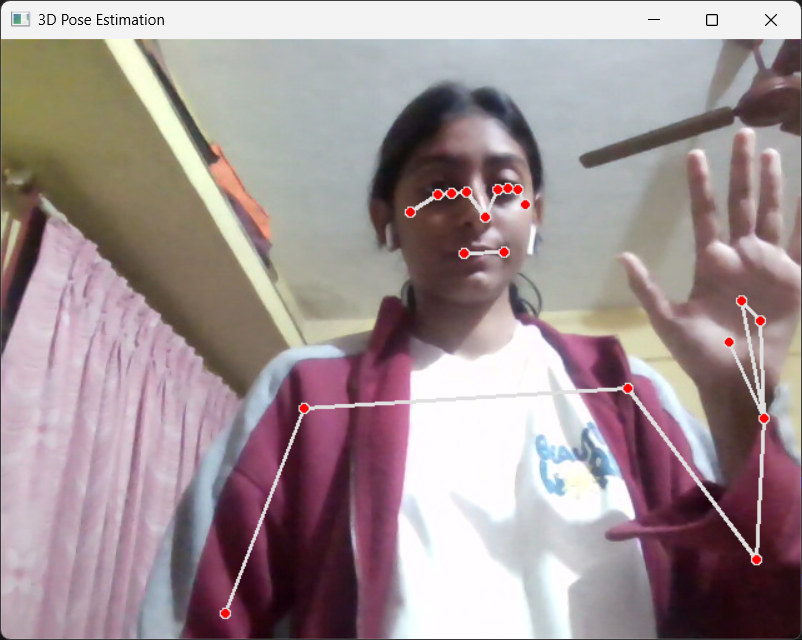

# 3D-Human-Skeleton-Extraction-and-Pose-Estimation
Detects and visualizes 3D human body joints in real time using MediaPipe and OpenCV. Identifies 33 landmarks to create a live skeleton overlay for posture and motion analysis. Useful for fitness, sports, and gesture recognition.

-Simran Khokale  
📧 simrankhokale@gmail.com  
